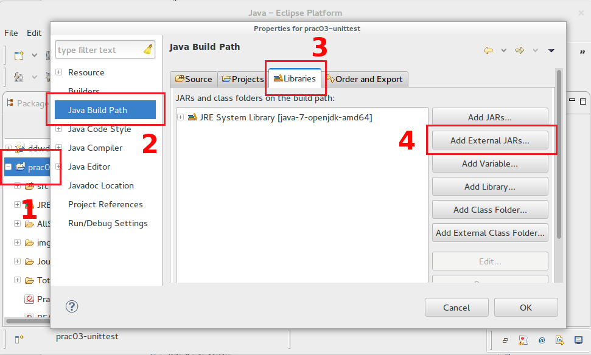
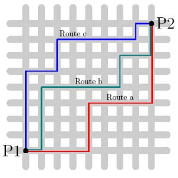

CAB302 Software Development
===========================

# Practical 3: Automated Unit Testing

This week's practical exercises aim to get you familiar with designing and implementing automated unit tests using the JUnit plug-in to the Eclipse integrated development environment.

* * *

## Setting up

When you import the project in the accompanying practical material into Eclipse, it should already have **JUnit 4** as a referenced library, using Eclipse's own copy of JUnit.

*If the version of Eclipse on your computer does not have a copy of JUnit inbuilt, or there are problems with its version, follow the instructions in the remaining of this section.*

You will need __both__ a `junit.jar` and `hamcrest-core.jar`, from [this repository](https://github.com/junit-team/junit/wiki/Download-and-Install) where you can find download packages of multiple different versions. Specifically, you will need the 'jar' download of [JUnit 4.12](http://search.maven.org/remotecontent?filepath=junit/junit/4.12/junit-4.12.jar) and [Hamcrest Core 1.3](http://search.maven.org/remotecontent?filepath=org/hamcrest/hamcrest-core/1.3/hamcrest-core-1.3.jar).
Save these files somewhere convenient - you will need them for future practicals and assignments.
You can also get the Javadocs jar to have a copy of the documentation, but you can view this online [here](http://junit.sourceforge.net/javadoc/).

After you have imported this practical's project into Eclipse, you will need to add the downloaded jar files to the project. To do this:

1. Right click on the project `prac03-unittest` in the `Package Explorer` panel and click `Properties` at the bottom of the pop-up menu.
2. Select the `Java Build Path` section of the project properties.
3. Select the `Libraries` tab.
4. Click the `Add External JARs` button and select your downloaded `junit-4.12.jar` and `hamcrest-core-1.3.jar` (either at the same time, or repeat the adding procedure).

If you have added the jar files correctly, you should see them in the `Package Explorer` as `Referenced Libraries`:

## Practical Exercises

### Group Exercise 1: Test case brainstorming (Totaliser example)

This exercise will give you practice at devising black-box test cases for a simple class.

In the materials supplied for this practical session you will find API documentation for three classes, including one called `Totaliser`. (This documentation was generated from a correct version of the program.) Read the [documentation for the `Totaliser`](doc/TotaliserAPI/index.html) class and then, as a group, identify a small, but sufficient, set of test cases that will exercise the `Totaliser` implementation's functionality. Your tutor will write the test cases selected on the whiteboard.

* * *

### Individual Exercise 1: Testing with JUnit (Totaliser example)

This exercise will give you practice at using JUnit to test a simple class.

In the materials supplied for this practical session you will find an implementation of the `Totaliser` class in the `totaliserQuestion` package ***but do not edit or examine it yet!*** The purpose of the exercise is to test the supplied program as a black box, i.e., without looking at the source code.

Create a new package called `totaliserAnswers` and inside that create a JUnit Test Class called `TotaliserTest.java`. In this class, implement the various tests identified in the previous exercise. Run your tests and see if you can identify any problems with the supplied program. NB: Eclipse will automatically recognise that your `TotaliserTest.java` file is a JUnit test class and will allow you to 'run' it as a JUnit test as soon as you have added a method with an `@Test` annotation to the file.

**Hint:** There are (at least) two errors in the code, one obvious and one a bit harder to detect.

When you think your tests have identified the problems with the program examine the `Totaliser.java` source code file to confirm your suspicions. Then correct the errors in the code and rerun your tests to ensure that the problems have been fixed.

* * *

### Group Exercise 2: Test case brainstorming (AllSame example)

This exercise will give you practice at devising black-box test cases for a more complicated, but stateless, class.

Read the [API documentation for the `AllSame` class](doc/AllSameAPI/index.html) and, as a group, identify a sufficient set of tests for it. Note that the method provided by this class is a pure function, i.e., it does not update any fields within the class and thus has no 'memory' from one invocation to the next, which simplifies testing.

### Individual Exercise 2: Testing with JUnit (AllSame example)

This exercise will give you practice at using JUnit to test a complicated, stateless class.

In the materials supplied for this practical session you will find three different
implementations of the `AllSame` class in the package `allSameQuestion`: `AllSameA.java`, `AllSameB.java` and `AllSameC.java` - ***again, do not look at the code for these yet***. Develop a test class `AllSameTests.java` using the test cases identified in the previous exercise, your challenge is to identify which, if any, of these implementations is correct, and what the problems with the incorrect implementations are. Look at the code only when you have completed the exercise, in order to confirm your findings.

**Hint:** In the three implementations there are (at least) three distinct errors in total.

**Note:** Testing three different programs with one set of test cases is an unusual situation and is a little awkward, no matter how it's done. One approach is to, in your JUnit test class, manually edit which of the three programs is imported into the test class to change from one to the other. Another approach is to put each of the three programs in its own package and have a copy of the test case class in each one. (There is a much more elegant solution which works by creating a superclass for the three programs under test, but it is felt to be a little complex for this one-off exercise.)

* * *

### Group Exercise 3: Test case brainstorming (JourneyPlanner example)

This exercise will give you practice at devising black-box test cases for a complicated, stateful class.

Read the [API documentation for the `JourneyPlanner` class](doc/JourneyPlannerAPI/index.html) and, as a group, identify a sufficient set of tests for it. Note that this class updates private fields and thus retains a 'memory' from one method invocation to the next, making it hard to devise test cases with good 'coverage'.

**Background:** The class calculates journey times based on 'Manhattan distances', i.e., the distance you must travel in a grid-like environment by following the grid lines only (with no diagonal steps). The name derives from the exceptionally regular layout of streets in New York city, which forces people to travel in this way. Notice in the diagram above that the journey from point P1 to P2 is of the same length, no matter which route is taken.

* * *

### Individual Exercise 3: Testing with JUnit (JourneyPlanner example)

This exercise will give you practice at using JUnit to test a complicated, stateful class.

In the materials supplied for this practical session you will find two different implementations of the `JourneyPlanner` class in the `journeyPlannerQuestion` package: `JourneyPlannerA.java` and `JourneyPlannerB.java` - ***again, do not look at the code for these yet***.  Develop a test class `JourneyPlannerTests.java` using the test cases identified in the previous exercise, your challenge is to identify which, if any, of these implementations is correct, and what the problems are in the incorrect class or classes. Look at the code only when you have completed the tests, in order to confirm your findings.

**Hint:** In the two implementations there are (at least) two distinct errors in total.
